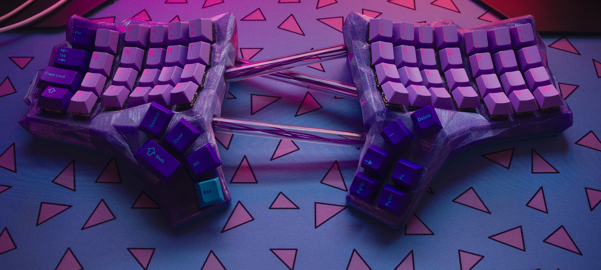
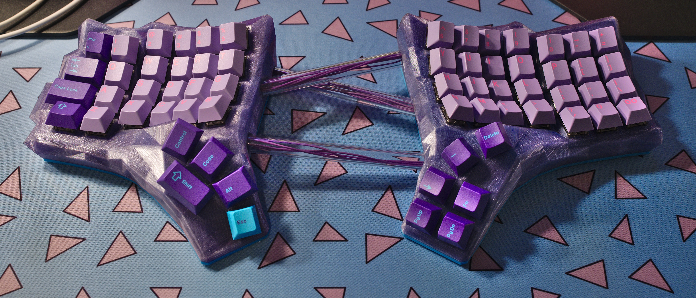
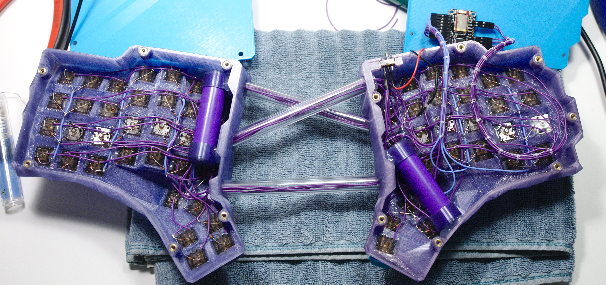
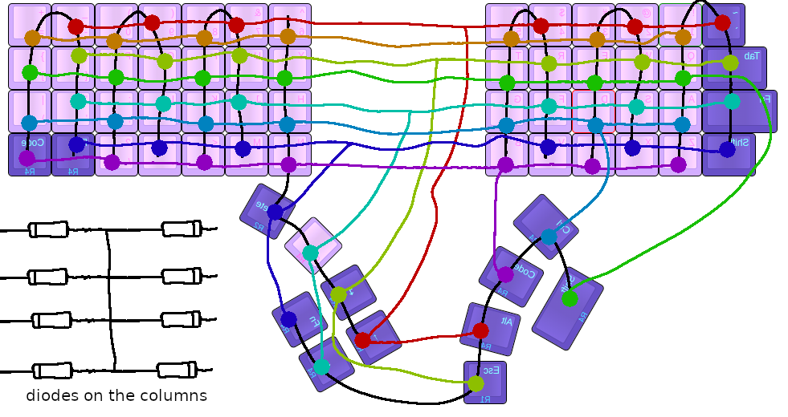
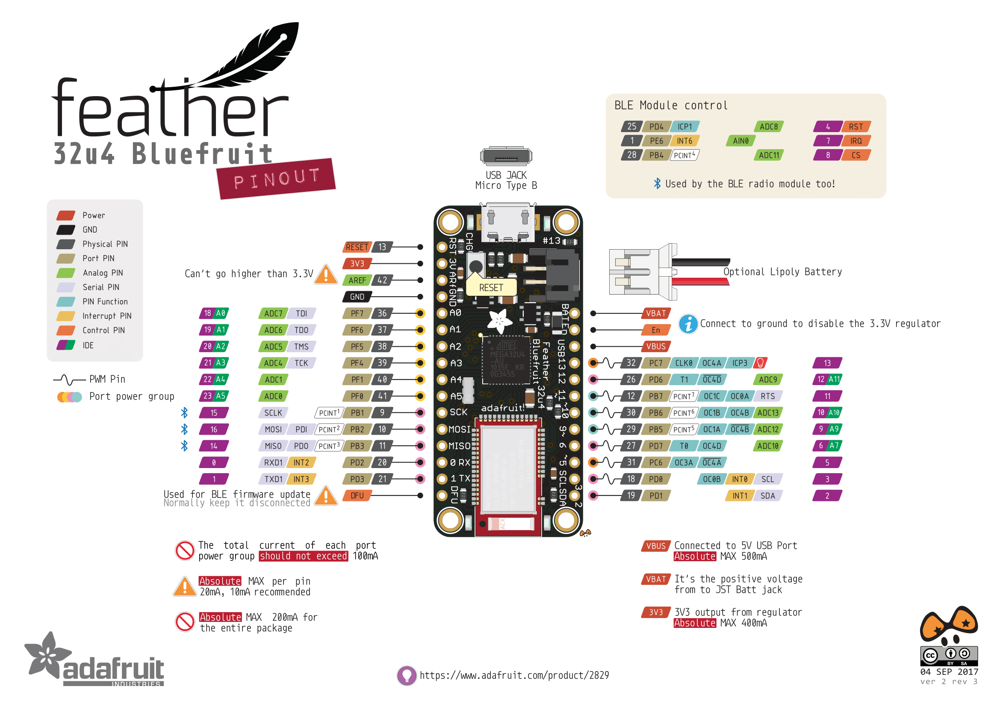

# Custom, Cherry profile, Bluetooth, Dactyl Manuform Keyboard

## Thanks Matthew & Tom

Derived from the [original Dactyl](https://github.com/adereth/dactyl-keyboard), and later, the [Dactyl Manuform](https://github.com/tshort/dactyl-keyboard).

[Video on the history of the original Dactyl](https://www.youtube.com/watch?v=uk3A41U0iO4)

----

## Build Outline

* 1N4148 signal Diodes
* Cherry MX/Kailh Box style switches
* [3D printed cases, case bottom covers](stl-models)
* 12mm <abbr title="Outer Diameter">OD</abbr> PETG watercooling tubing (approximately 380mm total, in lengths of: 118mm, 128mm, 134mm)
* Superglue or 2-part epoxy
* Hot glue gun
* 28AWG silicone insulated wire
* M3 x 5mm(L) x 5mm(OD) Brass Inserts
* M3-0.5 x 8mm flat countersunk screws
* [Adafruit Feather 32u4 Bluefruit LE](https://www.adafruit.com/product/2829) micro controller (Pro Micro with Bluetooth)
* [JST PH 2-Pin cable from Adafruit](https://www.adafruit.com/product/261) (for Feather boards)
* [QMK Firmware for this specific keyboard](https://github.com/jamiehs/qmk_firmware/tree/master/keyboards/dactyl_manuform_bluetooth), in my fork of QMK

## Backstory; Why it is not parametric

I wanted to experiment with creating a Dactyl that I could use GMK caps on without the row profiles getting weird. I took the regular Dactyl layout and then re-created the cases in Blender, along with custom angles for the different rows. So another way of saying it is: Looks like GMK, Feels like DSA - all the rows line up nicely; even the backslash key that's actually R4.

I got a bit carried away with using tubes to join the halves, but there's a functional aspect to them as well. In order to maximize battery life, I'm only running one controller in this board. That means that I needed to run the matrix wiring between the halves too. This could have been done with an HDMI connector or another multi-core wire, but I think this worked out well and looks pretty cool.

Because the changes I ended up making are so drastic; there wasn't really a possibility of backporting it to Clojure.

It's powered by an [Adafruit Feather 32u4 Bluefruit LE](https://www.adafruit.com/product/2829) module, and a pair of 18650 cells wired in parallel. The batteries lasted 432 hours (2 and a half weeks) before I got fed up and just charged the thing. It took over 24 hours to fully charge though 🤨... So I still technically don't know how long it lasts on batteries. The cells that were used were salvaged from a robot vacuum cleaner pack of four, where one was dead and causing failure of the whole pack; so they cost $0.

**[Additional back-story and experimentation](https://www.reddit.com/r/ErgoMechKeyboards/comments/fos88x/progress_on_my_custom_cherrygmkcompatible_dactyl/)** 

**[Another build without the low-poly effect](https://www.reddit.com/r/MechanicalKeyboards/comments/g5shvi/custom_bluetooth_dactyl_manuform_additional_notes/fo5afsn/)** 

### Top Side of the keyboard, sporting GMK Vaporwave

The PETG tubes are glued into place during assembly of the case halves (I used clear 2 part epoxy). It's wise to use some sandpaper to roughen the edges of the tubes that will be exposed to the adhesive in order to aid bonding. [The tubes should be these lengths](images/tubes.jpg).

### Underside with the bottom covers removed, showing the controller and batteries

#### Switches

Each switch is stabilized and protected against accidental pulling by squeezing a small amount of hot glue into the gap near the side of the switch. This is enough glue to be removable, and yet enough to wedge the switch into the socket once it has dried. This is completely optional.

#### Controller

The micro controller is held to the bottom cover using some double sided tape. The pictured keyboard uses Dupont connectors and angled headers to attach the wiring.

#### Inserts

The brass heat-set inserts are pressed into the case at a reasonable temperature. I was able to use 210&deg; C on my Hakko FX888D. For other brands of PLA you may want to use 190&deg; C as the PLA I used was technically HTPLA printed at 222&deg; C and can toughen a bit after being printed. Don't apply too much pressure when inserting them as it can get the tip of the iron stuck in the insert which damages it, and may mess up the hole when you try to remove the iron.

#### Battery

The pair of 18650 3.7 V lithium cells are wired in parallel, only after confirming that they are a voltage match (the pictured ones came from the same original pack and were a match). **If you don't know what you're doing when it comes to charging, handling, and working on lithium cells safely; just [buy a pouch style Li-po from Adafruit](https://www.adafruit.com/product/258).**

**Triple check the polarity before connecting the battery's JST connector.**

The cells were capped off with the [battery-cap model](stl-models/battery-cap.stl) in the stl folder, and a few drops of hot glue was used to keep them in place. I soldered the battery wires directly to the cell's terminals. This is not advised, and I only did it because I've gotten away with it in the past. I know this is not the right way to do it. Please use your own judgement and maybe get some [individual spring loaded 18650 holders](https://www.amazon.com/dp/B013DUOJV4) instead.

The Adafruit board only charges at 100 mA, so it will take about a day and a half to charge a pair of 18650 cells wired in parallel. The good news is that they have lasted up to 2.5+ weeks on one charge in my experience.

#### Column & Row Wiring

The columns are formed by pointing the diodes towards the switches (black line closest to the respective switch), and having a common path on the other side of the component; light blue wires visible in most columns. There should be three "double" columns in the right (left when upside down) half, and then one extra single column that extends into the thumb cluster of 1u keys. The left half (right when upside down) should share the fifth column with it's thumb cluster, and the two additional keys left out of the fourth column. Columns six, seven, and eight are all "double" columns that continue to the right of the image.

### Matrix image created by Reddit user [TeXitoi](https://www.reddit.com/user/TeXitoi/) as a gracious response to one of my questions

The matrix for this Dactyl Manuform is 100% custom due to the design decision of only using one micro controller, and only having 17 available GPIOs to use. TeXitoi was able to show me how to loop the columns around so two columns of switches share one IO column, and every row of switches skips every other switch. This allows the use of only 16 pins (8 rows, and 8 columns), leaving one free for RGB or something else. I have flipped the image here for easier assembly when the keyboard is facing belly up.

The columns are wired to pins 12 through 2; left to right (yes, in reverse order), and pin 13 is available to use for other PWM applications.

#### The columns are wired as (viewing from underside)

|Column Pin | Column Number |
|--------|------------------|
| 12     | 1 (left half)    |
| 11     | 2 (left half)    |
| 10     | 3 (left half)    |
| 9      | 4 (left half)    |
| 6      | 5 (both)         |
| 5      | 6 (right half)   |
| 3      | 7 (right half)   |
| 2      | 8 (right half)   |

#### The rows are wired as (viewing from underside)

|Row Pin | Color        |
|--------|--------------|
| A0     | orange       |
| A1     | red          |
| A2     | green        |
| A3     | lime green   |
| A4     | light blue   |
| A5     | teal         |
| 0      | purple       |
| 1      | blue         |

If you get the row and column pin ordering wrong in assembly, that's not a problem. [These values can be swapped around](https://github.com/jamiehs/qmk_firmware/blob/master/keyboards/dactyl_manuform_bluetooth/config.h#L18-L19) when you are flashing your firmware.

**Note: Ports `PB1`, `PB2`, `PB3` (pins `SCK`, `MOSI`, `MISO`) are not available for use as the BLE module uses these!**

